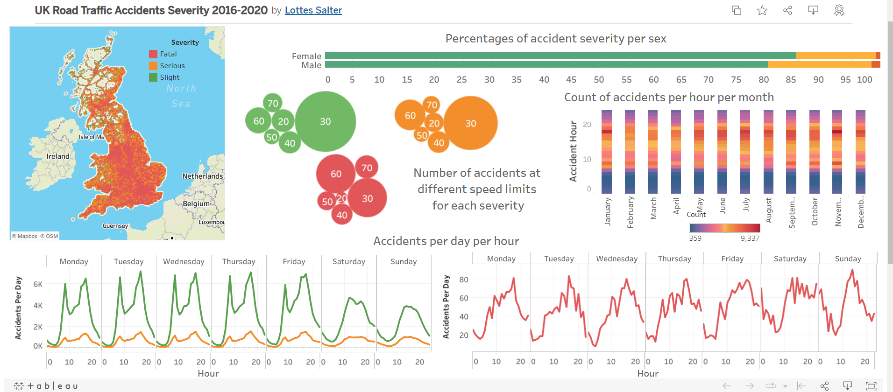

## Project

A look into the effect of day, time, year and gender on the severity of road accidents in the UK between 2016 and 2020.

## Method

Sorted and analysed the data using Excel and MS SQL Server. The SQL code can be viewed [here](https://github.com/LottesofCode/Road-Traffic-Accidents-UK/blob/main/SQLCarAccidents.sql).

## Results

A selection of results are shown in this [Tableau dashboard](https://public.tableau.com/views/UKRoadTrafficAccidentsSeverity2016-2020/Dashboard1?:language=en-US&publish=yes&:display_count=n&:origin=viz_share_link).

- Men are twice as likely to have a fatal accident, and 1.25 times more likely to be in a serious collision, compared with women.
- Most mild and severe accidents occur at 30 mph, whereas both 30 mph and 60 mph account for the majority of fatal accidents. 73% of accidents take place on single-carriageway roads — where there is no central barrier between the lanes — meaning accidents can easily become severe or fatal at the national speed limit of 60 mph.
- Both mild and severe accidents peak at 08:00 and 17:00, Monday to Friday, correlating with peak commuting hours. Fatal accidents don't follow this bimodal pattern, instead peaking around 17:00 — likely caused by weary or impatient commuters.
- There are fewer mild and severe accidents on Saturdays and Sundays, due to a lack of commuter traffic. Interestingly, there's no corresponding drop in fatal accidents; in fact, the peak number of fatal accidents occurs on Sundays at 14:00.
- Overall there are more accidents in the summer months. However, there are more commuter-hour accidents in winter, where darker light conditions may play a role.
- The greatest number of accidents occur on the A38, followed by the A23, A4 and A1. The M25 has the most of any motorway, likely explained by its sheer traffic volume.
- There was too much missing or null data on driver age group to analyse it reliably.

## Further work

There's a wealth of data in this dataset, with much more insight available. Further investigations could look at:

- Which gender of driver is most likely to crash on a motorway versus an A road.
- Which road features (junctions, pedestrian crossings, traffic lights) most influence accident severity.
- How big a role carriageway obstructions play in causing severe or fatal accidents.

## Data

Data obtained from [UK Gov Road Safety Data](https://www.data.gov.uk/dataset/cb7ae6f0-4be6-4935-9277-47e5ce24a11f/road-safety-data).
